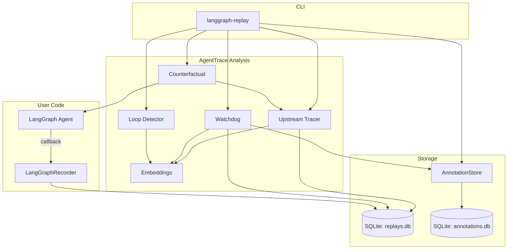
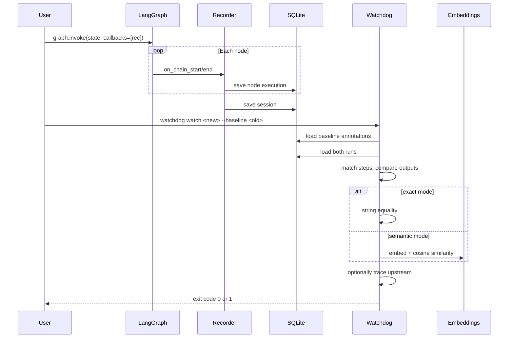

<p align="center">
  
</p>

<h1 align="center">langgraph-replay + AgentTrace</h1>

<p align="center">
  <strong>Record, replay, debug, and regression-test LangGraph agent executions.</strong>
</p>

<p align="center">
  <a href="https://www.python.org/downloads/"></a>
  <a href="LICENSE"></a>
  <a href="#"></a>
  <a href="https://deepwiki.com/Sushit-prog/AgentTrack"></a>
  <a href="#quick-start"></a>
  <a href="#roadmap"></a>
</p>

<p align="center">
  <a href="#quick-start">Quick Start</a> ·
  <a href="#features">Features</a> ·
  <a href="#architecture">Architecture</a> ·
  <a href="#cli-reference">CLI</a> ·
  <a href="#how-it-works">How It Works</a> ·
  <a href="#roadmap">Roadmap</a>
</p>

---

## The Problem

LangGraph agents are opaque. When a multi-step agent fails or regresses, you get:

- **No record** of what happened at each node
- **No replay** to step through past executions
- **No regression detection** when code changes break existing behavior
- **No upstream tracing** to find *why* a downstream node produced wrong output

Existing observability tools show you flat spans or trees. They don't tell you which node dropped a critical state key, why output quality degraded, or what to change in your code.

## The Solution

**langgraph-replay** records every node execution in a LangGraph run. **AgentTrace** layers regression testing, loop detection, semantic diffing, upstream cause tracing, and counterfactual replay on top — all CLI-first, zero cloud dependency, 100% local.

```
Your 6-node agent produced wrong output
  → langgraph-replay blame --diagnose session_abc
  → Blamed: summarize (confidence: high)
  → Why: Key 'context' dropped and never recovered
  → Fix: Remove the has_bug conditional at line 5-10

  → langgraph-replay watchdog watch new_run --baseline old_run
  → 2 regressions detected, exit code 1

  → langgraph-replay counterfactual test run --from-divergence report.json
  → Regression resolved — upstream divergence confirmed as cause
```

---

## Features

<table>
<tr>
<td width="50%">

### Recording & Replay
- **Callback-based recording** — one line to instrument any LangGraph graph
- **Step-by-step replay** — navigate forward/backward through execution
- **LLM cost tracking** — per-node token usage and cost estimation
- **Provider leaderboard** — compare Groq, OpenAI, Anthropic, Mistral performance

</td>
<td width="50%">

### Debugging & Attribution
- **Blame engine** — identifies which node caused a failure by walking backwards
- **Auto-diagnosis** — LLM-powered root cause analysis with source code references
- **TUI debugger** — Textual-based interactive session inspector
- **Semantic search** — find sessions by meaning, not just IDs

</td>
</tr>
<tr>
<td width="50%">

### Regression Detection
- **Annotation-grounded comparison** — human judgments as ground truth
- **Exact + semantic diffing** — catches real regressions, ignores wording changes
- **CI-gate exit codes** — 0=clean, 1=regression, 2=config error
- **Upstream cause tracing** — find which tool output changed before the regression

</td>
<td width="50%">

### Advanced Analysis
- **Loop detection** — classify stuck loops vs. legitimate retries
- **Counterfactual replay** — test causal hypotheses by replaying with substituted values
- **`--from-divergence`** — feed upstream reports directly into counterfactual testing
- **Demo fixtures** — ready-to-use CI gate failure scenarios

</td>
</tr>
</table>

---

## Quick Start

### Installation

```bash
pip install langgraph-replay
```

### Record a Run

```python
from langgraph_replay import record_session

with record_session("my_agent") as rec:
    result = graph.invoke(state, config={"callbacks": [rec]})
    print(f"Recorded: {rec.session_id}")
```

### Annotate Steps

```bash
langgraph-replay annotate add <session_id> parse_input -j correct -n "Parsed correctly"
langgraph-replay annotate add <session_id> process_data -j incorrect -n "Dropped context key"
```

### Pin a Baseline

```bash
langgraph-replay baseline set <session_id>
```

### Detect Regressions

```bash
langgraph-replay watchdog watch <new_run_id> --baseline <baseline_id>
# Exit code 1 = regression detected
```

### Trace Upstream Causes

```bash
langgraph-replay watchdog watch <new_run_id> --baseline <baseline_id> --upstream
```

### Test Causal Hypotheses

```bash
langgraph-replay counterfactual test <run_id> \
  --baseline <baseline_id> \
  --graph "my_module:build_graph" \
  --thread-id <thread_id> \
  --from-divergence upstream_report.json
```

### Detect Stuck Loops

```bash
langgraph-replay loopcheck <run_id>
```

---

## Architecture




### Data Flow



---

## CLI Reference

### Core Commands

| Command | Description |
|---------|-------------|
| `langgraph-replay list` | List recent recorded sessions |
| `langgraph-replay show <id>` | Show session details and node executions |
| `langgraph-replay debug <id>` | Launch TUI debugger |
| `langgraph-replay diff <a> <b>` | Compare two sessions side-by-side |
| `langgraph-replay blame <id>` | Identify which node caused a failure |
| `langgraph-replay blame <id> --diagnose` | Root cause analysis with fix suggestions |
| `langgraph-replay search <query>` | Semantic search across all sessions |
| `langgraph-replay providers` | LLM provider performance leaderboard |
| `langgraph-replay export <id>` | Export session to JSON |
| `langgraph-replay delete <id>` | Delete a session |

### AgentTrace Commands

| Command | Description |
|---------|-------------|
| `annotate add <run> <step> -j <judgment>` | Add judgment to a step |
| `annotate list <run>` | List annotations for a run |
| `annotate export <run> -o file.json` | Export annotations to JSON |
| `baseline set <run>` | Pin a baseline run |
| `baseline show` | Show pinned baseline |
| `watchdog watch <run> --baseline <id>` | Detect regressions |
| `watchdog watch <run> --semantic` | Semantic diff mode |
| `watchdog watch <run> --upstream` | Trace upstream causes |
| `loopcheck <run>` | Classify stuck loops |
| `counterfactual test <run> --from-divergence <file>` | Test causal hypotheses |

### Exit Codes

| Code | Meaning |
|------|---------|
| `0` | No regression detected / clean |
| `1` | Regression detected |
| `2` | Configuration error (missing baseline, no annotations, etc.) |

---

## How It Works

### 1. Recording

The `LangGraphRecorder` is a LangChain callback handler that intercepts every node execution:

```python
from langgraph_replay import record_session

with record_session("support_agent") as rec:
    result = graph.invoke({"ticket": "I need a refund"}, config={"callbacks": [rec]})
# Session saved to ~/.langgraph_replay/replays.db
```

What gets recorded per node:
- Input state (full dict)
- Output state (full dict)
- Execution duration (ms)
- Status (success/error)
- LLM calls (model, tokens, latency, cost)

### 2. Annotation

Human judgments on steps create ground truth for regression detection:

```bash
langgraph-replay annotate add run_042 check_eligibility -j correct -n "Policy lookup accurate"
langgraph-replay annotate add run_042 process_refund -j correct -n "Refund processed correctly"
```

Judgments: `correct`, `incorrect`, `expected`, `unexpected`

Only `correct` and `expected` annotations trigger regression checks — `incorrect` and `unexpected` are bug-tracking signals, not regression signals.

### 3. Regression Detection

The watchdog compares a new run against a pinned baseline:

```bash
langgraph-replay watchdog watch run_043 --baseline run_042
```

```
! check_eligibility              REGRESSION (exact-match: non-text field)
    baseline: '{"eligible": true, "reason": "Within 30-day window"}'
    new run:  '{"eligible": false, "reason": "Requires proof of defect"}'
~ parse_ticket                   unchanged
! process_refund                 REGRESSION (exact-match: non-text field)
    baseline: '{"status": "approved", "refund_id": "REF-4455"}'
    new run:  '{"status": "denied", "refund_id": null}'

Result: 2 regression(s) found. Exit code 1.
```

Steps are matched by `(node_name, occurrence_index)` — the same node running twice gets matched by position.

### 4. Semantic Diffing

Opt-in `--semantic` mode reduces false positives from wording changes:

```bash
langgraph-replay watchdog watch run_043 --baseline run_042 --semantic
```

Non-text outputs (JSON dicts, numbers) fall back to exact match — the report shows `(exact-match: non-text field)` so you know which path ran. Only genuine plain text goes through the embedding model.

### 5. Upstream Tracing

When a regression is flagged, `--upstream` traces backward through ancestor steps:

```bash
langgraph-replay watchdog watch run_043 --baseline run_042 --upstream
```

```
! process_refund                 REGRESSION
  Possible upstream causes:
    [tool_output] node "check_eligibility" (step 2)
      field: tool_calls[0].output
      similarity: 0.62 (below threshold 0.85)
      baseline: 'Full refund for orders within 30 days'
      new:      'Refunds require proof of defect within 14 days'
```

### 6. Counterfactual Replay

Test whether a specific upstream divergence *causally* explains a regression:

```bash
langgraph-replay counterfactual test run_043 \
  --baseline run_042 \
  --graph "support_agent:build_graph" \
  --thread-id thread_abc \
  --from-divergence upstream_report.json
```

The tool replays the graph from a forked checkpoint with the baseline's value substituted. If the regression disappears, the divergence is causally implicated.

### 7. Loop Detection

Classifies repeated node visits as stuck loops or legitimate retries:

```bash
langgraph-replay loopcheck run_044
```

```
Node: fetch_weather_api (visited 4 times)
  Classification: stuck_loop
  Reasoning: avg similarity 0.97 across visits, no change in remaining step count

Node: retry_payment (visited 3 times)
  Classification: legitimate_retry
  Reasoning: avg similarity 0.81, tool arguments changed between visits
```

---

## Project Structure

```
langgraph-replay/
├── src/langgraph_replay/          # Core recording & debugging
│   ├── storage.py                 # SQLite ORM (Session, NodeExecution)
│   ├── recorder.py                # LangGraph callback handler
│   ├── cli.py                     # Click CLI (15 commands)
│   ├── blame.py                   # Failure attribution engine
│   ├── diff.py                    # State/session diffing
│   ├── search.py                  # Semantic search (MiniLM-L6-v2)
│   ├── diagnosis.py               # LLM-powered root cause analysis
│   ├── replay.py                  # Step-by-step session navigation
│   ├── watchdog.py                # File-watching regression detector
│   └── tui/                       # Textual TUI debugger
│
├── agenttrace/                    # Evaluation & regression layer
│   ├── annotations/               # Phase 1: Ground truth storage
│   ├── watchdog/                  # Phases 2,4,5: Regression detection
│   ├── loopdetect/                # Phase 3: Loop classification
│   ├── counterfactual/            # Phase 6: Causal testing
│   ├── fixtures/                  # Test data & demo scenarios
│   └── tests/                     # 88 tests
│
├── tests/                         # 53 pre-existing tests
├── ROADMAP.md
└── pyproject.toml
```

---

## Algorithms

### Semantic Diff

Embeds both outputs using `all-MiniLM-L6-v2` (384-dim, CPU-only), computes cosine similarity. Non-text values (dicts, lists, numbers, bools, None) fall back to exact match — no embedding call.

### Loop Classifier

Embeds concatenated input+output state for each visit to a repeated node. Computes pairwise cosine similarities within a configurable window. High similarity + no state variation + no input changes = `stuck_loop`. Otherwise = `legitimate_retry`.

### Blame Attribution

Walks backward through execution: finds keys present in initial input but missing from final output, identifies the first node where the key was in input but not output AND never reappears. Priority: error status > key dropping > semantic blame.

### Upstream Divergence

For each ancestor of a regressed step, diffs tool call outputs and retrieved-context entries. Uses semantic matching for string fields, exact equality for non-strings. Returns changed fields with similarity scores.

---

## Configuration

### Environment Variables

| Variable | Default | Description |
|----------|---------|-------------|
| `LANGGRAPH_REPLAY_DB` | `~/.langgraph_replay/replays.db` | Trace storage path |
| `AGENTTRACE_DB` | `~/.langgraph_replay/annotations.db` | Annotation storage path |
| `GROQ_API_KEY` | — | For LLM diagnosis |
| `OPENAI_API_KEY` | — | For LLM diagnosis |
| `ANTHROPIC_API_KEY` | — | For LLM diagnosis |
| `MISTRAL_API_KEY` | — | For LLM diagnosis |
| `LLM_JUDGE_PROVIDER` | `mistral` | Default diagnosis provider |
| `LLM_JUDGE_MODEL` | (per provider) | Default diagnosis model |

### CLI Flags

| Flag | Default | Description |
|------|---------|-------------|
| `--semantic` | off | Enable embedding-based comparison |
| `--semantic-threshold` | 0.90 | Similarity threshold for semantic mode |
| `--upstream` | off | Trace upstream causes on regressions |
| `--from-divergence` | — | Load divergence from JSON report |
| `--threshold` | 0.85 | Threshold for loop classifier |
| `--window` | 3 | Comparison window for loop classifier |
| `--quiet` | off | Suppress human-readable output |
| `--output` | stdout | JSON report output path |

---

## Testing

```bash
# Run all tests (141 total)
python -m pytest agenttrace/ tests/ -v

# Run agenttrace tests only (88)
python -m pytest agenttrace/ -v

# Run specific test file
python -m pytest agenttrace/tests/test_semantic_diff.py -v
```

### Test Coverage

| Module | Tests | What It Proves |
|--------|-------|----------------|
| annotations | 8 | CRUD, overwrite prevention, filtering, export |
| watchdog compare | 8 | Regression detection, exact/semantic modes |
| watchdog CLI | 7 | Exit codes, baseline round-trip, JSON schema |
| upstream divergence | 18 | DAG traversal, tool extraction, similarity |
| semantic diff | 16 | String similarity, threshold, non-text fallback |
| classifier | 6 | Stuck loop vs. legitimate retry |
| cycle finder | 4 | Repeated node detection |
| counterfactual | 12 | Graph loading, replay, resolution |
| phase 7 | 9 | Serialization, --from-divergence, demo fixture |
| pre-existing | 53 | Blame, diff, search, diagnosis, storage |

---

## Roadmap

### Shipped

- **Phase 1** — Span Annotation Layer: SQLite-backed human judgments
- **Phase 2** — Regression Watchdog: CI-gate comparison with exit codes
- **Phase 3** — Loop Classifier: Stuck loop vs. legitimate retry detection
- **Phase 4** — Semantic Diffing: Opt-in embedding-based comparison
- **Phase 5** — Upstream Tracing: Find which tool output changed
- **Phase 6** — Counterfactual Replay: Test causal hypotheses
- **Phase 7** — Wiring: `--from-divergence`, demo fixtures, ROADMAP

### Deliberately Deferred

- **Flakiness scorer** — Requires repeated runs; expensive on CPU
- **OTel export** — Vendor spec drift risk; local SQLite serves primary use case
- **Schema validator** — Over-engineering for current scale

### Out of Scope

- **Web UI** — CLI/CI-native is the product; a hosted UI is a different pitch

---

## Comparison

| Feature | LangGraph Replay | LangSmith | Langfuse | Phoenix |
|---------|:---:|:---:|:---:|:---:|
| Local-first | ✅ | ❌ | Partial | ✅ |
| CLI-native | ✅ | ❌ | ❌ | ❌ |
| Replay | ✅ | ❌ | ❌ | ❌ |
| Regression detection | ✅ | ❌ | ❌ | ❌ |
| Annotation-grounded | ✅ | ❌ | ❌ | ❌ |
| Counterfactual replay | ✅ | ❌ | ❌ | ❌ |
| Loop detection | ✅ | ❌ | ❌ | ❌ |
| Upstream tracing | ✅ | ❌ | ❌ | ❌ |
| CI exit codes | ✅ | ❌ | ❌ | ❌ |
| Semantic search | ✅ | ✅ | ✅ | ✅ |
| LLM diagnosis | ✅ | ❌ | ❌ | ❌ |
| Cost tracking | ✅ | ✅ | ✅ | ❌ |

---

## Contributing

1. Fork the repository
2. Create a feature branch (`git checkout -b feature/amazing-feature`)
3. Commit your changes (`git commit -m 'Add amazing feature'`)
4. Push to the branch (`git push origin feature/amazing-feature`)
5. Open a Pull Request

### Development Setup

```bash
git clone https://github.com/Sushit-prog/langgraph-replay.git
cd langgraph-replay
pip install -e ".[dev]"
pytest
```

---

## License

MIT License — see [LICENSE](LICENSE) for details.

---


<p align="center">
  Built with care for the LangGraph community.
</p>
